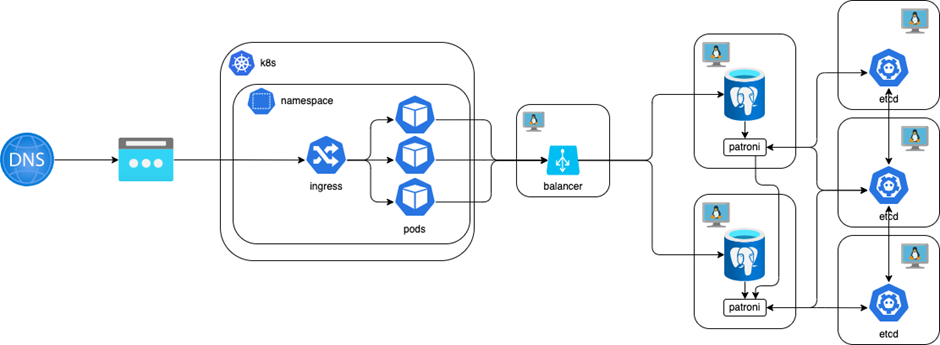

# Документация

* В папке [/ansible](/ansible) - ansible-playbook для развертывания кластера из двух postgresql в patroni сетапе с тремя etcd для DCS и балансировщиком Haproxy для подключения к кластеру БД.
  * Для развертывания требуются шесть ВМ в одной приватной сети - db1, db2, etcd1, etcd2, etcd3, balancer.
  * На ВМ db1 и db2 требуется минимум 2GB RAM.
  * На ВМ balancer требуется публичный IP.
  * Доступ из интернета к публичному IP балансера ограничен правилами iptables в [/ansible/postgresql_cluster/vars/system.yml](/ansible/postgresql_cluster/vars/system.yml) в разделе:
  ```
      firewall_additional_rules_for:
        balancers:
  ```
    * Плейбуки
      * первичной установки - deploy_pgcluster.yml
      * изменения конфигурации - config_pgcluster.yml
    * Код и документация исходного проекта - https://github.com/vitabaks/postgresql_cluster
  
* В папке [/helm](/helm) - helm-chart для разворачивания api в неймспейсе sre-cource-student-18
  * Параметры подключения api к БД задаются в [/helm/sre-course-api/templates/deployment.yaml](/helm/sre-course-api/templates/deployment.yaml)
  * в spec: containers: env: name: CONNECTIONSTRINGS__PGCONNECTION
  * в формате 
  ``` value: server=IP; port=5000; database=weather; user id=postgres; password=postgres-pass; ```
  , где IP - публичный адрес балансировщика.

* Схема кластера
<picture>
  
</picture>
